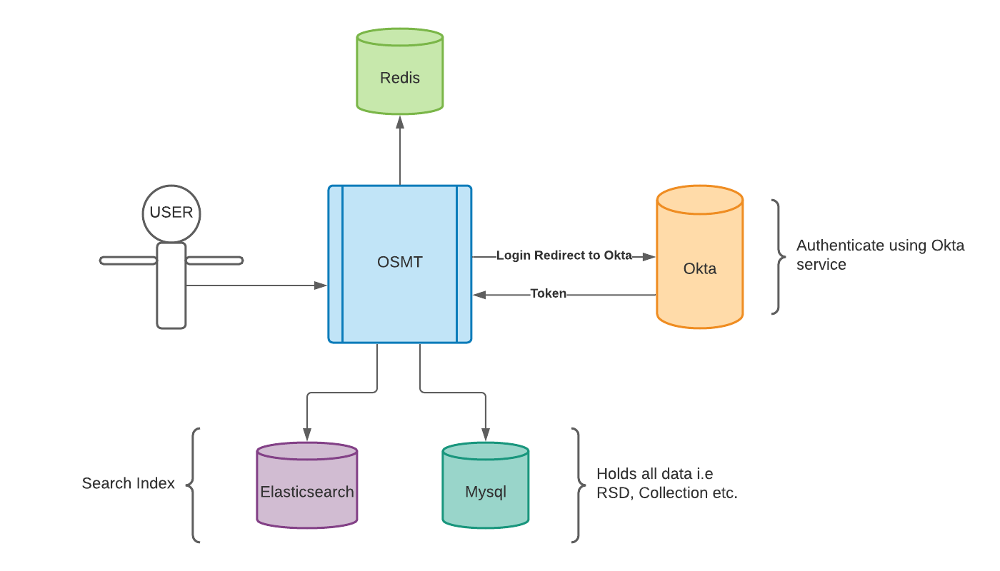
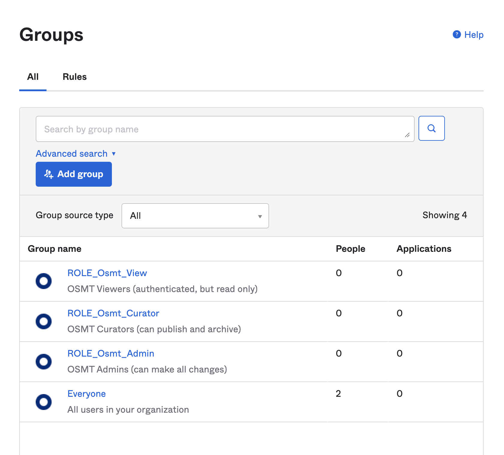
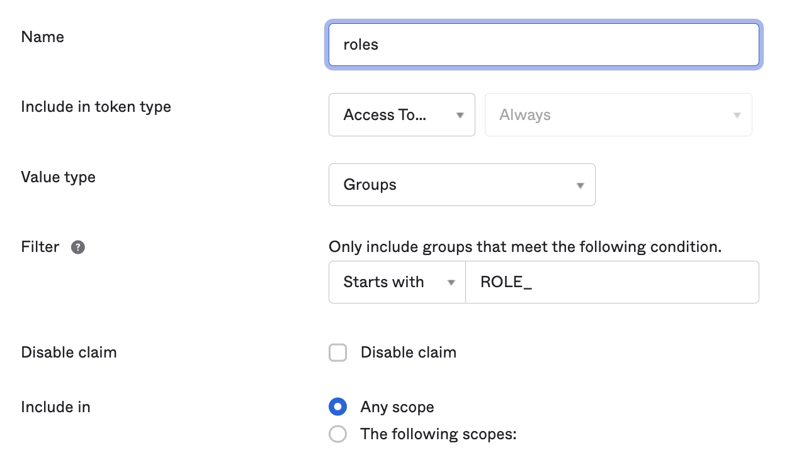
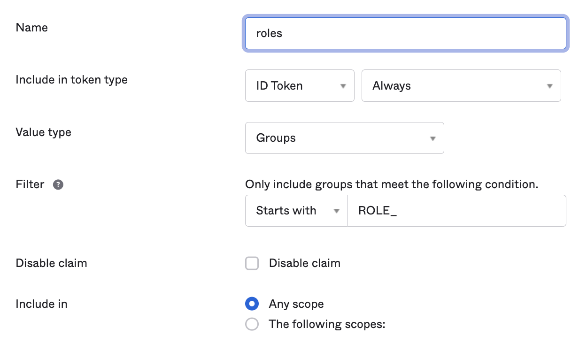
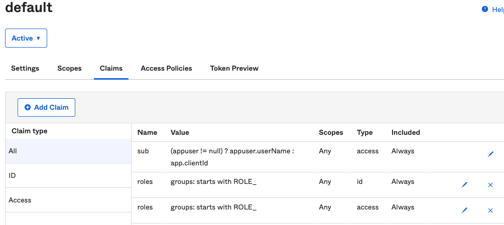
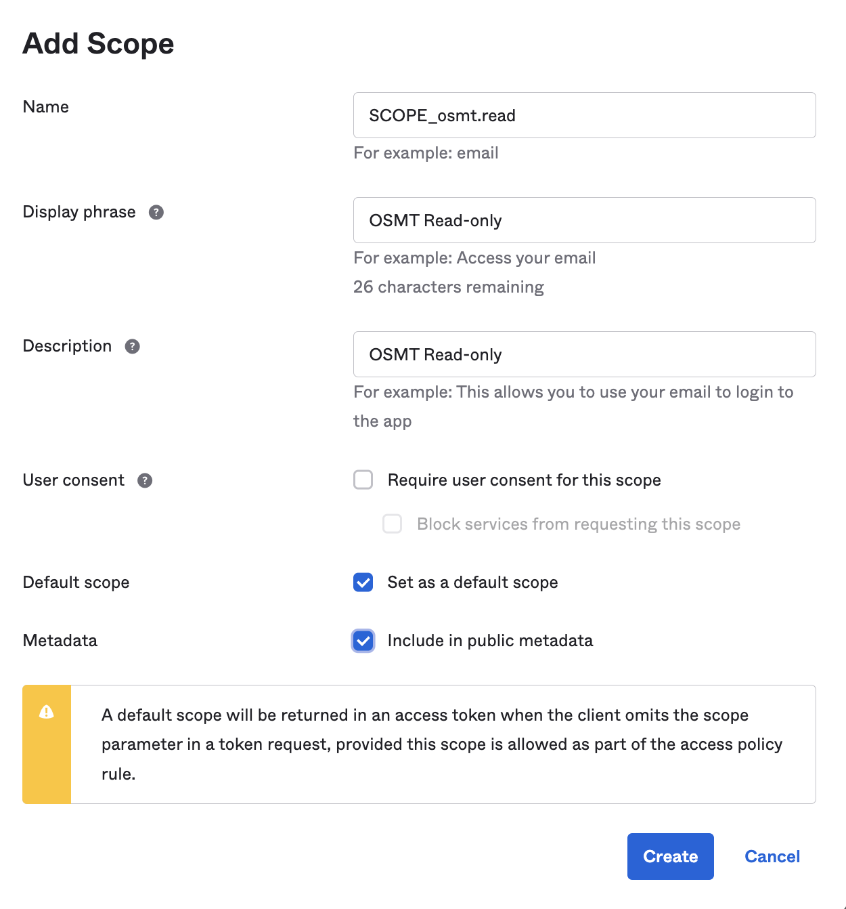

# WGU Open Skills Management Toolset (OSMT)

## Overview
The Open Skills Management Tool (OSMT, pronounced "oz-mit") is a free, open-source instrument to facilitate the production of Rich Skill Descriptor (RSD) based open skills libraries. In short, it helps to create a common skills language by creating, managing, and organizing skills-related data. An open-source framework allows everyone to use the tool collaboratively to define the RSD, so that those skills are translatable and transferable across educational institutions and hiring organizations within programs, curricula, and job descriptions.

## Architecture
OSMT is written in Kotlin with Spring Boot, and Angular. It uses backend-instances of MySQL, Redis, and Elastisearch.

[](docs/arch/Architectural-Diagram.png)

## Dependencies
OSMT uses Elasticsearch, Redis, and MySQL as back-end dependencies. OSMT also requires an OAuth2 provider. Local / non-production configurations can be stood up using only Docker. See additional notes below for [Configuration](README.md#configuration).

## Getting started
Follow the steps in the [Pre-requisites](README.md#pre-requisites) section.
* Please have the right technical people in your organization deploy a production OSMT instance before making any real investment in effort for building skills.
* For latest updates, reach out in the [Discussion](https://github.com/wgu-opensource/osmt/discussions) boards in GitHub.

### Using the OSMT CLI utility (`osmt_cli.sh`)
The OSMT source code includes a utility named `osmt_cli.sh`, in the project root directory. `osmt_cli.sh` simplifies setting up a local OSMT environment and doing routine tasks. It uses BASH, and works on MacOS and Linux. We have had some success with a BASH interpreter in Windows. You can run `./osmt_cli.sh -h` for the help text.
* `osmt_cli.sh` uses git to help identify directory context. If you downloaded the source code as a ZIP file, you will need to have git installed to use `osmt_cli.sh`.

### Pre-requisites
By default, OSMT is wired up for Okta as an OAuth2 provider. While you can change this, these documents will only address configuring Okta.
1. Obtain a "free developer" Okta account. This is required to log in to a local OSMT. Please follow the steps in [OAuth2 and Okta Configuration](README.md#oauth2-and-okta-configuration) below, and return here when complete. You can refer to [Environment file for Development and API Tests Stack](README.md#environment-files-for-development-and-api-tests-stacks) for more details.

2. Initialize your environment files. After running this, update the OAUTH2/OIDC values in the env files (replace the `xxxxxx` values with the correct values from your Okta account)
    ```
    ./osmt_cli.sh -i
    ```

### Running the Development configuration
1. Validate your local environment (for Docker, Java, and other SDKs / runtimes). If this command reports error, you will need to resolve them before running the Development configuration. See more in the [Requirements to Build OSMT](README.md#requirements-to-build-osmt) section
    ```
    ./osmt_cli.sh -v
    ```

2. **From the project root**, run a Maven build. The API module currently depends on the UI module.
    ```
    mvn clean install
    ```
   * The Maven build starts its own Docker containers for testing purposes. It may disrupt any existing OSMT-related Docker containers you have running. 

3. Start (restart) the back-end MySQL/Redis/ElasticSearch dependencies.
    * This starts the dev-stack.yml docker-compose stack. It will run "detached", meaning running in the background. You can use `docker ps` and `docker logs` to see what the services are doing.
    ```
    ./osmt_cli.sh -d
    ```

5. If you prefer, you can import BLS and O*NET job code metadata. This step is optional. See [Post-installation (BLS, O*NET, etc)](README.md#post-installation-bls-onet-etc) and [](api/README.md#importing-data) for more details.
    ```
    ./osmt_cli.sh -m
    ```

6. Start the Spring application.
   * This automatically sources the `api/osmt-dev-stack.env` file. It will also serve the static Angular files.
    * You can exit the Spring application by pressing [Ctrl-C].
   ```
   ./osmt_cli.sh -s
   ```

7. Shut down & removes the back-end MySQL/Redis/ElasticSearch dependencies.
   * This stops & destroys the dev-stack.yml docker-compose stack.
    ```
    ./osmt_cli.sh -e
    ```

### Housekeeping with `osmt_cli.sh`
You can surgically clean up OSMT-related Docker images and data volumes. This step **will** delete data from Development and API Test configurations. It does not remove the mysql/redis/elasticsearch Docker images, as those may be available locally for other purposes.
    
```
./osmt_cli.sh -c
```

### Using the CI Static Dataset
OSMT source code has a [static/fixed dataset](test/sql/fixed_ci_dataset.sql) included in the repo, to be used for automated testing in a CI (continuous integration) environment. This dataset is meant to be in sync with the application as of any given commit (i.e., make a DB change, update the SQL script).

This dataset is meant as an on-ramp for the local developer, and as a fixed quantity for automated testing. It includes about 1200 RSDs and several collections, both in different publish states. As we expand our automated testing around OSMT, we should adapt this dataset to cover test cases as needed.

You can follow these steps to apply this dataset:
1. Build your OSMT application
    ```
    mvn clean install
    ```
2. Destroy your local OSMT-related Docker volumes.
    ```
    ./osmt_cli.sh -c
    ```
3. Start the Spring Boot application with `./osmt_cli.sh -s` (this command also starts the Docker stack). Spring Boot will build the database schema via Flyway. Leave this shell open with the Spring Boot app running.
    ```
    ./osmt_cli.sh -s
   ```
4. From another shell, load the CI static dataset. This command empties all MySQL tables, and requires the mysql client.
    ```
    ./osmt_cli.sh -l
    ```
5. From this same shell, reindex OSMT's ElasticSearch. When this is complete, you can close this 2nd shell.
    ```
    ./osmt_cli.sh -r
    ```

## Building OSMT

### Requirements to Build OSMT Locally
OSMT requires certain software and SDKs to build:
* Docker >=17.06.0
  * Recommended 6 GB memory allocated to the Docker service. On Windows, Docker will possibly need more memory.
* a Java 17 JDK (OpenJDK works fine)
* Maven 3.8.3 or higher
* NodeJS v18.18.2 / npm 9.8.1 or higher
  * NodeJS/npm are used for building client code; there are no runtime NodeJS/npm dependencies.
  * In the `ui` module, `frontend-maven-plugin` uses an embedded copy of Node v16.13.0 and npm 8.1.0.
  * Locally, a developer probably has their own versions of NodeJS and npm installed. They should be >= the versions given above.

Run `osmt_cli.sh -v` for feedback on your local SDKs and runtimes. The output of this command may be helpful in troubleshooting with the OSMT community as well.

### Project Structure
OSMT is a multi-module Maven project. pom.xml files exist in the project root, `./api` and `./ui` directories. Running the command `mvn clean install` from the project root will create a fat jar in the target directory that contains both the backend server and the prod-built Angular frontend static files.

    -- project root
     |-- api                - Spring Boot, Kotlin-based backend
     |-- docs               - Techincal and OpenAPI documentation
     |-- import             - CSV files for importing
     |-- docker             - Docker resources for base images and development
     \-- ui                 - Angular frontend

* `mvn package` may work fine, but the `api` module depends on artifacts from the `ui` module. `mvn install` will place the ui artifacts in your local Maven repo, and will decouple your local builds from the presence of the jar file being present in `ui/target`.

The [API](api/README.md) and [UI](ui/README.md) modules have their own README.md files with more specific information about those modules.

### Configuration
This project does "Development" configuration. It relies on docker-compose and environment files. Follow the steps in [Pre-requisites](README.md#pre-requisites) above. 

### Development Configuration
The Development configuration uses the `dev-stack.yml` docker-compose file in the `docker` directory, for standing up just the back-end dependencies. This facilitates doing active development in the Spring or Angular layers. You can use `osmt_cli.sh` in the steps given in [Running the Development configuration](README.md#running-the-development-configuration) to simplify starting and stopping the Docker services and Spring application.

* You are not required to use `osmt_cli.sh`.
  * You can run this command to stand up the Development configuration.
      ```
      cd docker; docker-compose --file dev-stack.yml up
      ```
  * You can manage the local Spring application directly. See [Running from the Command Line](api/README.md#running-from-the-command-line) for details

If doing front-end development, start the UI Angular front end. The Angular app proxies requests to the backend server during development. This allows one to use Angular's live reloading server.
  - From the `ui` directory, run these commands:
    - `npm install`
    - `npm start`
  - Open your browser to `http://localhost:4200`.

### OAuth2 and Okta Configuration
To use Okta as your OAuth2 provider, you will need a free developer account with [Okta Free Account](https://developer.okta.com/signup). While the user interface at Okta may change, the big ideas of configuring an application for an OAuth/OpenID Connect provider should still apply. From your Okta Dashboard:

Before you start with these steps, you may be required to update your goals on the Okta website. 
1. If given the option, navigate to the "Admin" section.
2. Navigate to Applications. Create an Application Integration, select the "OIDC - OpenID Connect" option and "Web Application" option.
3. Under the "General Settings" area:
   - Enter an "App integration name". The intention here is local OSMT development.
   - Enter a "Sign-in redirect URIs", use `http://localhost:8080/login/oauth2/code/okta`
   - Enter a "Sign-out redirect URIs", use `http://localhost:8080`
4. Under the "Assignments" area:
   - Choose "Skip group assignment for now".
5. Save your new Web Application Integration. Okta should show your new Wep App, with a few tabs towards the top.
6. In the "General" tab, under "Client Credentials":
   - Copy/paste the value for Client ID into your osmt-*.env file, for `OAUTH_CLIENTID`.
   - Copy/paste the value for Client Secret into your osmt-*.env file, for `OAUTH_CLIENTSECRET`.
7. In the "Sign-On" tab, under "OpenID Connect ID Token":
   - Click "Edit", and for Issuer, choose the option that actually has an Okta URL. Save the OpenID Connect ID Token.
   - Copy/paste the value for Issuer into your osmt-*.env file, for OAUTH_ISSUER. Ensure your URL has the `https://` protocol.
     - You may need to ensure your issuer URL ends with `/oauth2/default` ie `https://dev-XXXXX.okta.com/oauth2/default`
   - Copy/paste the value for Audience into your osmt-*.env file, for OAUTH_AUDIENCE.
8. In the Assignments tab:
   - Click "Assign", and choose "Assign to People". For your Okta user ID, click "Assign". Leave defaults; then click "Save and Go Back".

When using Okta, you will use the `oauth2-okta` profile for Spring Boot, which will include the properties from [application-oauth2-okta.properties](api/src/main/resources/config/application-oauth2-okta.properties). This properties file relies on secrets being provided via the environment. The commands in `osmt_cli.sh` automatically provide the appropriate environment files.

If you want to enable OSMT user permissions by roles, see additional details in [Role-based Access in OSMT](README.md#role-based-access-in-osmt).

### Environment Files for Development and API Tests Stacks
There are many ways to provide environment values to a Spring application. That said, you should never push secrets to GitHub, so you should never store secrets in source code. The OSMT project is configured to git ignore files named `osmt*.env`, and we recommend you follow this approach. 
The OSMT source code includes example environment files for the Development configuration (`api/osmt-dev-stack.env.example`) and API Tests configuration (`test/api/osmt-apitest.env.example`). Running `./osmt_cli.sh -i` will create env files for you, but you will need to replace the 'xxxxxx' values with your OAUTH2/OIDC values, following the guidance in the [OAuth2 and Okta Configuration](README.md#oauth2-and-okta-configuration) section.

#### Alternate approaches for Providing Environment Variables
* Provide these OAuth2 values as program arguments when starting your Spring Boot app (`-Dokta.oauth2.clientId="123456qwerty"`).
* Set environment variables by supplying json
    * For MacOS & Linux, replace <placeholder> values and run below command.
      ```
      export SPRING_APPLICATION_JSON="{\"OAUTH_ISSUER\":\"<oauth_issuer>\",\"OAUTH_CLIENTID\":\"<aouth_client>\", \"OAUTH_CLIENTSECRET\":\"<oauth_clientsecret>\",\"OAUTH_AUDIENCE\":\"<oauth_audience>\"}"
      ```
    * For Windows, replace <placeholder> values and run below command.
      ```
      set SPRING_APPLICATION_JSON="{\"OAUTH_ISSUER\":\"<oauth_issuer>\",\"OAUTH_CLIENTID\":\"<aouth_client>\", \"OAUTH_CLIENTSECRET\":\"<oauth_clientsecret>\",\"OAUTH_AUDIENCE\":\"<oauth_audience>\"}"
      ```

### Post-installation (BLS, O*NET, etc)
For Development configuration, you can import the metadata with this command:
```
osmt_cli.sh -m
```
* Keep in mind that removing Docker volumes will also remove this metadata. For more information, see the section for [Importing Data](api/README.md#importing-data) in the API README file.

### Role-based Access in OSMT
* Role-based access is **enabled** by default for the Angular UI and Spring REST API.

OSMT optionally supports role-based access, with these roles:
- **Admin**: an OSMT user with an admin role can change RSDs and Collections in any way.
- **Curator**: an OSMT user with a curator role can create RSDs and Collections. This role is for someone who would upload and create RSDs and Collections.
- **Viewer**: an OSMT user with a viewer role is a logged-in user who can not make modifications to RSDs or Collections.

| Behavior                                | Curator Role | Admin Role |
|-----------------------------------------|:------------:|:----------:|
| Update Skills                           |              | X          |
| Archive and Unarchive Skills            | X            | X          |
| Create Skills                           | X            | X          |
| Publish Skills                          |              | X          |
| Update Collection                       |              | X          |
| Archive and Unarchive Collection        | X            | X          |
| Create Collection                       | X            | X          |
| Publish Collection                      |              | X          |
| Delete Collection                       |              | X          |
| Add/Remove Skills to/from a Collection  |              | X          |
| Library Export                          |              | X          |
| Export Draft Collection                 |              | X          |
| Workspace Access                        | X            | X          |

#### Configuration in OSMT Code
By default, OSMT is configured with roles enabled. If you want to disable roles in OSMT, apply these changes:

In Angular UI: In [`auth-roles.ts`](ui/src/app/auth/auth-roles.ts) file, configure these values:
```
export const ENABLE_ROLES = false
```

In Spring REST API: In [`application.properties`](api/src/main/resources/config/application.properties) file, configure these values:
```
# Roles settings
app.enableRoles=false
```
* NOTE: if app.enableRoles=false, all authenticated endpoints will be accessible by any authenticated user.
* You can use these role values, or you can provide your own based on your own authorization tooling. For Okta, you will need to use the uppercase `ROLE_` prefix on your role.
* `read` is a scope, not a role. This is for machine-to-machine access, rather than for authenticated OSMT users.


#### Configuration in Okta
In Okta, navigate to "Directory", then "Groups". You will need to create 3 groups with names that match your `osmt.security.role` values in `application.properties`.

[](docs/int/okta/okta_groups_for_osmt_roles.png)

You can assign your Okta user accounts to these groups. In Okta, navigate to "Security", then "API". Open the "default" API, and navigate to the "Claims" tab.

* Add claim for "Access"

  [](docs/int/okta/okta_claims_access.png)

* Add a claim for  "ID Token"

  [](docs/int/okta/okta_claims_id.png)

* Your end result should look like this:

  [](docs/int/okta/okta_claims.png)

From the Scopes tab, add a scope with name that matches osmt.security.scope.read in application.properties

[](docs/int/okta/okta_scopes.png)

## How to get help
This project includes [./api/HELP.md](api/HELP.md), with links to relevant references and tutorials.

OMST is an open source project, and is supported by its community. Please look to the Discussion boards and Wiki on GitHub. Please see the [CONTRIBUTING.md](CONTRIBUTING.md) document for additional context.
