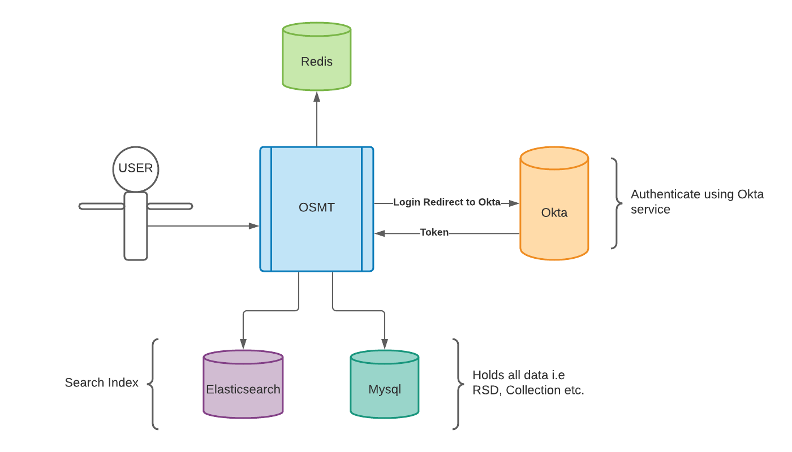

# WGU Open Skills Management Toolset (OSMT)

## Overview
The Open Skills Management Tool (OSMT, pronounced "oz-mit") is a free, open-source instrument to facilitate the production of Rich Skill Descriptor (RSD) based open skills libraries. In short, it helps to create a common skills language by creating, managing, and organizing skills-related data. An open-source framework allows everyone to use the tool collaboratively to define the RSD, so that those skills are translatable and transferable across educational institutions and hiring organizations within programs, curricula, and job descriptions.

## Architecture
OSMT is written in Kotlin with Spring Boot, and Angular. It uses backend-instances of MySQL, Redis, and Elastisearch.


## Dependencies
OSMT uses Elasticsearch, Redis, and MySQL as back-end dependencies. Any OSMT instance beyond a local development server also requires an OAuth2 provider. Local / non-production configurations can be stood up using only Docker. See additional notes below for [Configuration](README.md#configuration).

## Getting started
Follow the steps in the [Pre-requisites](README.md#pre-requisites) and [Running the Quickstart](README.md#running-the-quickstart) sections to bootstrap a local Quickstart OSMT instance (you can see more details in the [Quickstart Configuration](README.md#quickstart-configuration) section).
* NOTE: A Quickstart OSMT instance should be for demo purposes only. The data is stored on a Docker volume. Unless your organization has taken technical steps to ensure the backing data will remain available, you should consider Quickstart data to be temporary. If you create RSDs or Collections, you should export them before shutting down the Quickstart. See the [How-To](https://osmt.io/docs.html) section of osmt.io for more information on exporting.
* Please have the right technical people in your organization deploy a production OSMT instance before making any real investment in effort for building skills.

### Using the OSMT CLI utility (`osmt_cli.sh`)
The OSMT source code includes a utility named `osmt_cli.sh`, in the project root directory. `osmt_cli.sh` simplifies setting up an OSMT environment and doing routine tasks. It uses BASH, and works on MacOS and Linux. It may work with a BASH interpreter in Windows, but we have not yet tested this. You can run `./osmt_cli.sh -h` for the help text.
* `osmt_cli.sh` uses git to help identify directory context. If you downloaded the source code as a ZIP file, you will need to have git installed to use `osmt_cli.sh`.

### Pre-requisites
1. Obtain a "free developer" Okta account. This is required to log in to a local OSMT. Please follow the steps in [OAuth2 and Okta Configuration](README.md#oauth2-and-okta-configuration) below, and return here when complete. You can refer to [Environment files for Quickstart and Development Stacks](README.md#environment-files-for-quickstart-and-development-stacks) for more details.

2. Initialize your environment files. After running this, update the OAUTH2/OIDC values in the env files (replace the `xxxxxx` values with the correct values from your Okta account)
    ```
    ./osmt_cli.sh -i
    ```

### Running the Quickstart
1. Start the Quickstart configuration. This will take several minutes to download resources and build the software. If you continue to loop on errors that report "Retrying in 10 seconds...", there's something wrong. Search and reach out in the [Discussion](https://github.com/wgu-opensource/osmt/discussions) boards in GitHub.
    ```
    ./osmt_cli.sh -q
    ```

2. Open your browser to `http://localhost:8080`.

3. You can exit the Quickstart configuration by pressing [Ctrl-C].
    * If you don't clean up the Docker images and volumes, Quickstart should start very quickly when re-running `osmt_cli.sh -q`.

### Running the Development configuration
1. Validate your local environment (for Docker, Java, and other SDKs / runtimes). If this command reports error, you will need to resolve them before running the Development configuration. See more in the [Requirements to Build OSMT](README.md#requirements-to-build-osmt) section
    ```
    ./osmt_cli.sh -v
    ```

2. **From the project root**, run a Maven build. The API module currently depends on the UI module, so 'mvn package' will not be sufficient.
    ```
    mvn clean install
    ```

3. Start the back-end MySQL/Redis/ElasticSearch dependencies.
    * This starts the dev-stack.yml docker-compose stack. It will run "detached", meaning running in the background. You can use `docker ps` and `docker logs` to see what the services are doing.
    ```
    ./osmt_cli.sh -d
    ```

5. If you prefer, you can import BLS and O*NET job code metadata. This step is optional. See [Post-installation (BLS, O*NET, etc)](README.md#post-installation-bls-onet-etc) and [](api/README.md#importing-data) for more details.
    ```
    ./osmt_cli.sh -m
    ```

6. Start the Spring application.
   * This automatically sources the `api/osmt-dev-stack.env` file. It will also serve the static Angular files.
    * You can exit the Spring application by pressing [Ctrl-C].
   ```
   ./osmt_cli.sh -s
   ```

7. Shut down the back-end MySQL/Redis/ElasticSearch dependencies.
   * This stops the dev-stack.yml docker-compose stack.
    ```
    ./osmt_cli.sh -e
    ```

### Housekeeping with `osmt_cli.sh`
You can surgically clean up OSMT-related Docker images and data volumes. This step **will** delete data from local OSMT Quickstart and Development configurations. It does not remove the mysql/redis/elasticsearch images, as those may be available locally for other purposes.
```
./osmt_cli.sh -c
```

## Building OSMT

### Requirements to Build OSMT Locally
OSMT requires certain software and SDKs to build:
* Docker >=17.06.0
  * Recommended 6 GB memory allocated to the Docker service. On Windows, Docker will possibly need more memory.
* a Java 11 JDK (OpenJDK works fine)
* Maven 3.8.3 or higher
* NodeJS v16.13.0 / npm 8.1.0 or higher (the LTS versions at the time of this writing)
  * NodeJS/npm are used for building client code; there are no runtime NodeJS/npm dependencies.
  * In the `ui` module, `frontend-maven-plugin` uses an embedded copy of Node v16.13.0 and npm 8.1.0.
  * Locally, a developer probably has their own versions of NodeJS and npm installed. They should be >= the versions given above.

Run `osmt_cli.sh -v` for feedback on your local SDKs and runtimes. The output of this command may be helpful in troubleshooting with the OSMT community as well.

### Project Structure
OSMT is a multi-module Maven project. pom.xml files exist in the project root, `./api` and `./ui` directories. Running the command `mvn clean install` from the project root will create a fat jar in the target directory that contains both the backend server and the prod-built Angular frontend static files.

    -- project root
     |-- api                - Spring Boot, Kotlin-based backend
     |-- docs               - Techincal and OpenAPI documentation
     |-- import             - Example CSV files for importing
     |-- docker             - Docker resources for base images and development
     \-- ui                 - Angular frontend

* `mvn package` may work fine, but the `api` module depends on artifacts from the `ui` module. `mvn install` will place the ui artifacts in your local Maven repo, and will decouple your local builds from the presence of the jar file being present in `ui/target`.

The [API](api/README.md) and [UI](ui/README.md) modules have their own README.md files with more specific information about those modules.

### Configuration
This project makes use of 2 similar local configurations, "Quickstart" and "Development". These both rely on docker-compose and environment files. Follow the steps in [Pre-requisites](README.md#pre-requisites) above. See [Environment files for Quickstart and Development Stacks](README.md#environment-files-for-quickstart-and-development-stacks) for more details.

### Quickstart Configuration
The Quickstart configuration uses the `docker-compose.quickstart.yml` file in the project root to stand up a non-production OSMT stack. This stack uses containers for the Spring application and the back-end dependencies (MySQL, ElasticSearch, and Redis).
* The Quickstart configuration is opinionated, in that all services and volumes are stood up on a single machine. That topology may or may not be appropriate for your organization. It could inform how to configure a production OSMT instance, but it is not intended for a production deployment.
* Quickstart uses the `osmt-quickstart.env` file to provide your OAuth2 secrets, and override default values. If you break your working copy of this env file, you can refer to `osmt-quickstart.env.example` for the default values.
* By default, the Quickstart configuration automatically imports BLS and O*NET job code metadata, and reindexes ElasticSearch. You can alter this default behavior with the `REINDEX_ELASTICSEARCH` and `SKIP_METADATA_IMPORT` environment variables (export them in your shell, or uncomment them in `osmt-quickstart.env`).
* By default, Quickstart uses an image named `wguopensource/osmt-app:latest` as the Spring application. It will pull the image tagged `latest` from DockerHub.
  * You can override the tagged version number with the `OSMT_APP_IMAGE_TAG` environment variable (export it in your shell, or uncomment it in `osmt-quickstart.env`).
  * You can build a new Docker image for the Spring application, and tag it with `wguopensource/osmt-app:latest`. Quickstart will use it, instead of pulling from DockerHub.
* You are not required to use `osmt_cli.sh`. You can run this command from the project root to stand up the Quickstart configuration.
    ```
    docker-compose --file docker-compose.quickstart.yml --env-file osmt-quickstart.env --project-name osmt_quickstart up 
    ```

### Development Configuration
The Development configuration uses the `dev-stack.yml` docker-compose file in the `docker` directory, for standing up just the back-end dependencies. This facilitates doing active development in the Spring or Angular layers. You can use `osmt_cli.sh` in the steps given in [Running the Development configuration](README.md#running-the-development-configuration) to simplify starting and stopping the Docker services and Spring application.

* You are not required to use `osmt_cli.sh`.
  * You can run this command to stand up the Development configuration.
      ```
      cd docker; docker-compose --file dev-stack.yml up
      ```
  * You can manage the local Spring application directly. See [Running from the Command Line](api/README.md#running-from-the-command-line) for details

If doing front-end development, start the UI Angular front end. The Angular app proxies requests to the backend server during development. This allows one to use Angular's live reloading server.
  - From the `ui` directory, run these commands:
    - `npm install`
    - `npm start`
  - Open your browser to `http://localhost:4200`.

### OAuth2 and Okta Configuration
To use Okta as your OAuth2 provider, you will need a free developer account with [Okta Free Account](https://developer.okta.com/signup). While the user interface at Okta may change, the big ideas of configuring an application for an OAuth/OpenID Connect provider should still apply. From your Okta Dashboard:

Before you start with these steps, you may be required to update your goals on the Okta website. 
1. If given the option, navigate to the "Admin" section.
2. Navigate to Applications. Create an Application Integration, select the "OIDC - OpenID Connect" option and "Web Application" option.
3. Under the "General Settings" area:
   - Enter an "App integeration name". The intention here is local OSMT development.
   - Enter a "Sign-in redirect URIs", use `http://localhost:8080/login/oauth2/code/okta`
   - Enter a "Sign-out redirect URIs", use `http://localhost:8080`
4. Under the "Assignments" area:
   - Choose "Skip group assignment for now".
5. Save your new Web Application Integration. Okta should show your new Wep App, with a few tabs towards the top.
6. In the "General" tab, under "Client Credentials":
   - Copy/paste the value for Client ID into your osmt-*.env file, for `OAUTH_CLIENTID`.
   - Copy/paste the value for Client Secret into your osmt-*.env file, for `OAUTH_CLIENTSECRET`.
7. In the "Sign-On" tab, under "OpenID Connect ID Token":
   - Click "Edit", and for Issuer, choose the option that actually has an Okta URL. Save the OpenID Connect ID Token.
   - Copy/paste the value for Issuer into your osmt-*.env file, for OAUTH_ISSUER. Ensure your URL has the `https://` protocol.
     - You may need to ensure your issuer URL ends with `/oauth2/default` ie `https://dev-XXXXX.okta.com/oauth2/default`
   - Copy/paste the value for Audience into your osmt-*.env file, for OAUTH_AUDIENCE.
8. In the Assignments tab:
   - Click "Assign", and choose "Assign to People". For your Okta user ID, click "Assign". Leave defaults; then click "Save and Go Back".
9. OSMT does not require any additional scopes.

For Okta, you will use the `oauth2-okta` profile for Spring Boot, which will include the properties from [application-oauth2-okta.properties](api/src/main/resources/config/application-oauth2-okta.properties). This properties file relies on secrets being provided via the environment. The commands in `osmt_cli.sh` automatically provide the appropriate environment files.

### Environment Files for Quickstart and Development Stacks
There are many ways to provide environment values to a Spring application. That said, you should never push secrets to GitHub, so you should never store secrets in source code. The OSMT project is configured to git ignore files named `osmt*.env`, and we recommend you follow this approach. The OSMT source code includes example environment files for the Quickstart and Development configurations (`osmt-quickstart.env.example` and `api/osmt-dev-stack.env.example`). Running `./osmt_cli.sh -i` will create env files for you, but you will need to replace the 'xxxxxx' values with your OAUTH2/OIDC values, following the guidance in the [OAuth2 and Okta Configuration](README.md#oauth2-and-okta-configuration) section.

#### Alternate approaches for Providing Environment Variables
* Provide these OAuth2 values as program arguments when starting your Spring Boot app (`-Dokta.oauth2.clientId="123456qwerty"`).
* Set environment variables by supplying json
    * For MacOS & Linux, replace <placeholder> values and run below command.
      ```
      export SPRING_APPLICATION_JSON="{\"OAUTH_ISSUER\":\"<oauth_issuer>\",\"OAUTH_CLIENTID\":\"<aouth_client>\", \"OAUTH_CLIENTSECRET\":\"<oauth_clientsecret>\",\"OAUTH_AUDIENCE\":\"<oauth_audience>\"}"
      ```
    * For Windows, replace <placeholder> values and run below command.
      ```
      set SPRING_APPLICATION_JSON="{\"OAUTH_ISSUER\":\"<oauth_issuer>\",\"OAUTH_CLIENTID\":\"<aouth_client>\", \"OAUTH_CLIENTSECRET\":\"<oauth_clientsecret>\",\"OAUTH_AUDIENCE\":\"<oauth_audience>\"}"
      ```

### Post-installation (BLS, O*NET, etc)
The Quickstart configuration automatically imports the default BLS and O*NET job code metadata. For a Development configuration, you can import the metadata with this command:
```
osmt_cli.sh -m
```
Keep in mind that removing Docker volumes will also remove this metadata. For more information, see the section for [Importing Data](api/README.md#importing-data) in the API README file.

## How to get help
This project includes [./api/HELP.md](api/HELP.md), with links to relevant references and tutorials.

OMST is an open source project, and is supported by its community. Please look to the Discussion boards and Wiki on GitHub. Please see the [CONTRIBUTING.md](CONTRIBUTING.md) document for additional context.
