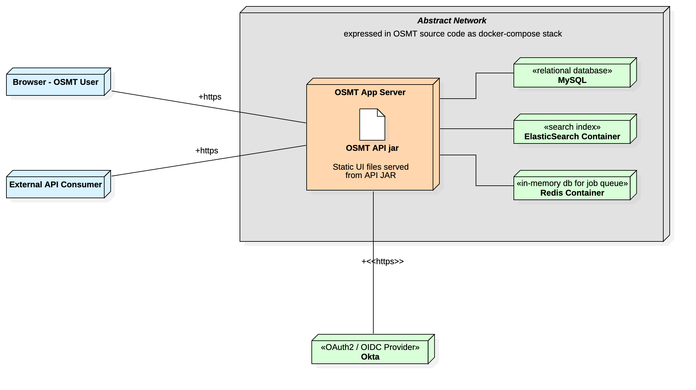
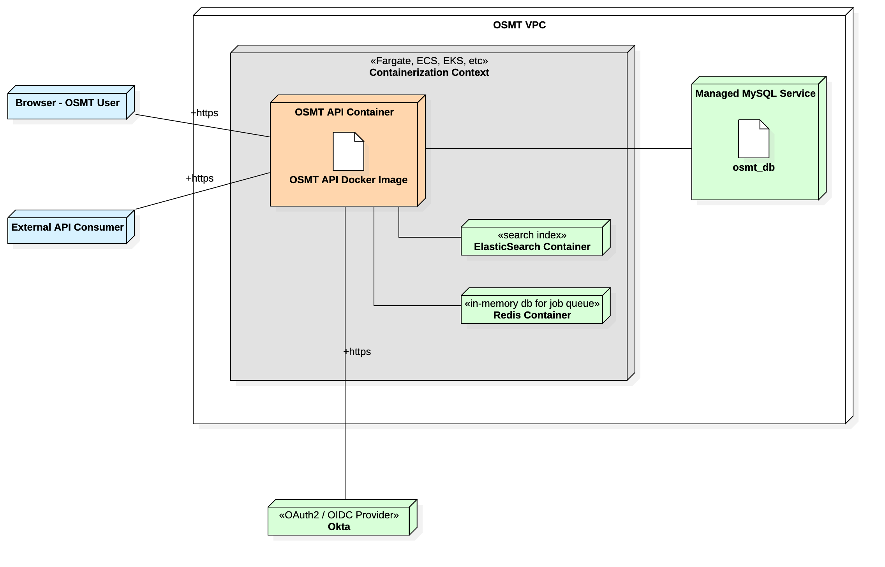

This document serves to explain some nuances in the Logical Deployment Diagrams in [osmt-model.mdj](osmt-model.mdj)

## OSMT Conceptual Deployment Diagram
This diagram outlines the basic dependencies for OSMT with being prescriptive of how they are satisfied. In this regard, it is more abstract than an LDD. It serves to inform a more proper implementation of a given LDD.

As-is, it expresses the docker-compose stack used in the local [Development configuration](../../README.md#development-configuration).

## OSMT SDLC Deployment Diagram
This diagram provides a starting point for deploying an ephemeral SDLC instance of OSMT in AWS. This kind of instance would not have any redundancy or load balancing, and would be deployed when commits are pushed to relevant branches.

